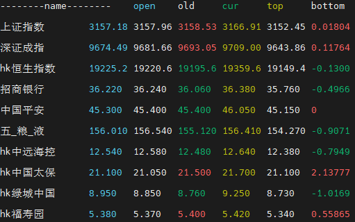

# shell-stock-display
This is the shell app that helps you view stocks in terminal.
😂
supports for A-shares and the H-shares market.

## How to use

First clone the repo into your disk.

```bash
$ git clone https://github.com/rootlulu/shell_stock_display.git
```

then

```bash

$ chmod +x run.sh

$ ./run.sh
```

## How to add your stocks

Edit stock_codes, just put stock codes here, like this:
```bash
sh603818
sz002475
sh600036
sz300433
sz300638
sz300750
sz300454
sh601888
sz002594
sh601012
```

### Sample


## License

MIT licensed
